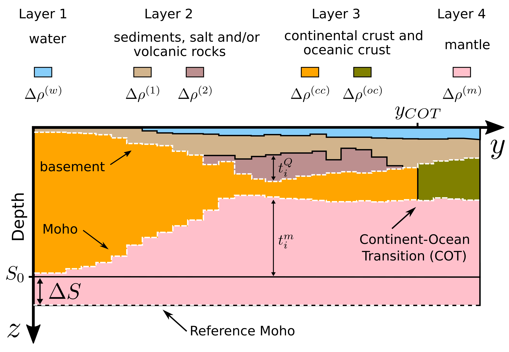

# Isostatic constraint for 2D non-linear gravity inversion on rifted margins

by
[B. Marcela S. Bastos](https://www.pinga-lab.org/people/marcela.html)1 and
[Vanderlei C. Oliveira Jr.](https://www.pinga-lab.org/people/oliveira-jr.html)1

1[Observatório Nacional](http://www.on.br/index.php/pt-br/)

This paper is published at
[*Geophysics*](https://doi.org/10.1190/geo2018-0772.1).

## Abstract

We propose a non-linear gravity inversion for simultaneously estimating the
basement and Moho geometries, as well as the depth of the reference Moho
along a profile crossing a passive rifted margin. To obtain stable solutions,
we impose smoothness on basement and Moho, force them to be close to previously
estimated depths along the profile and also impose local isostatic equilibrium.
Differently from previous methods, we introduce the information of local isostatic
equilibrium by imposing smoothness on the lithostatic stress exerted at depth.
Our method delimits regions that deviates and those that can be considered in local
isostatic equilibrium by varying the weight of the isostatic constraint along the profile.
Besides, it allows controlling the
degree of equilibrium along the profile, so that the interpreter can obtain a set of
candidate models that fit the observed data and exhibit different degrees of
isostatic equilibrium. Our method also differs from earlier studies because it
attempts to use isostasy for exploring (and not necessarily reducing) the inherent
ambiguity of gravity methods.
Tests with synthetic data illustrate the effect of our isostatic constraint on the
estimated basement and Moho reliefs, specially at regions with pronounced crustal
thinning, which are typical of passive volcanic margins. Results obtained by
inverting satellite data over the
Pelotas basin, an example of passive volcanic margin at the southern of Brazil,
agree with previous interpretations obtained independently by combining gravity,
magnetic and seismic data available to the petroleum industry. These results
show that, combined with a priori information, simple isostatic assumptions can be
very useful for interpreting gravity data on passive rifted margins.

*Schematic representation of the interpretation model approximating a passive
rifted margin*

## Reproducing the results

You can download a copy of all the files in this repository by cloning the
[git](https://git-scm.com/) repository:

    git clone https://github.com/pinga-lab/paper-isostatic-grav2D

All source code used to generate the results and figures in the paper are in
the `code` folder. The sources for the manuscript text and figures are in `manuscript`.
See the `README.md` files in each directory for a full description.

The calculations and figure generation are all run inside
[Jupyter notebooks](http://jupyter.org/).
You can view a static (non-executable) version of the notebooks in the
[nbviewer](https://nbviewer.jupyter.org/) webservice:

http://nbviewer.jupyter.org/github/pinga-lab/paper-isostatic-grav2D

### Running the code

To execute the code in the Jupyter notebooks, you must first start the
notebook server by going into the repository folder and running:

    jupyter notebook

We recommend using a [`conda environment`](https://conda.io/projects/conda/en/latest/user-guide/tasks/manage-environments.html).

This will start the server and open your default web browser to the Jupyter
interface. In the page, go into the `code` folder and select the
notebook that you wish to view/run.

The notebook is divided into cells (some have text while other have code).
Each cell can be executed using `Shift + Enter`.
Executing text cells does nothing while executing code cells runs the code
and produces it's output.
To execute the whole notebook, run all cells in order or use "Cell -> Run All"
from the menu bar.

## License

All source code is made available under a BSD 3-clause license.  You can freely
use and modify the code, without warranty, so long as you provide attribution
to the authors.  See `LICENSE.md` for the full license text.

The manuscript text/figures are not open source. The authors reserve the rights
to the article content, which is currently published for publication at
[*Geophysics*](https://doi.org/10.1190/geo2018-0772.1).
